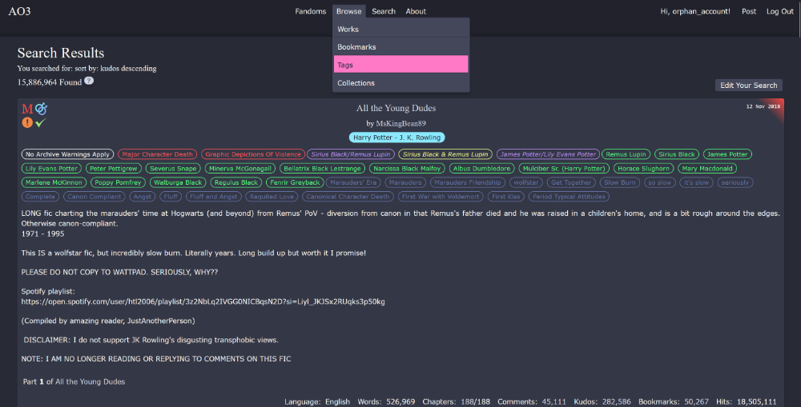
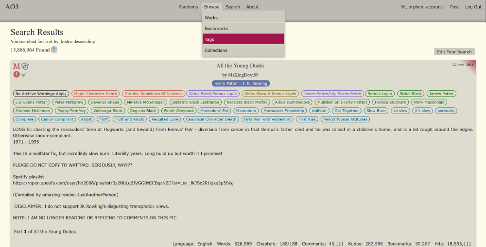
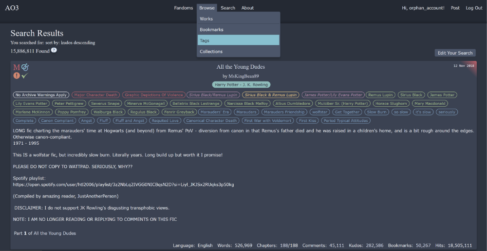
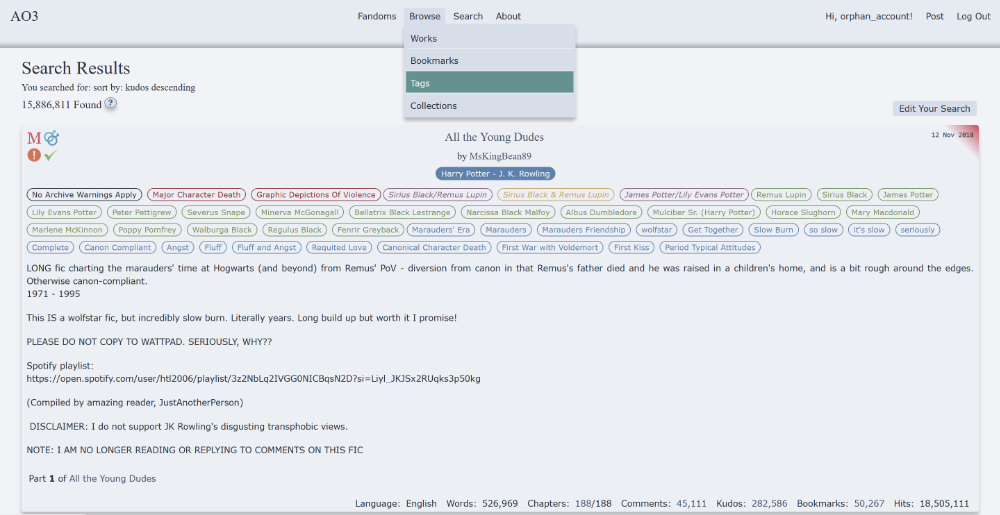

# AO3Skin - Themes

## Dracula (dark / light)

| Use                       | Dark mode | Light mode |
| ------------------------- | --------: | ---------: |
| Background Base           | `#21222C` |  `#BCBAB3` |
| Background Primary        | `#282A36` |  `#FFFBEB` |
| Background Secondary      | `#343746` |  `#DEDCCF` |
| Background Tertiary       | `#424450` |  `#ECE9DF` |
| Background Highlight      | `#44475A` |  `#CECCC0` |
| Text Primary              | `#F8F8F2` |  `#1F1F1F` |
| Text Highlight            | `#D6D8E1` |  `#343746` |
| Color Red                 | `#FF5555` |  `#CB3A2A` |
| Color Orange              | `#FFB86C` |  `#A34D14` |
| Color Yellow              | `#F1FA8C` |  `#846E15` |
| Color Green               | `#50FA7B` |  `#14710A` |
| Color Purple              | `#BD93F9` |  `#644AC9` |
| Color Blue                | `#6272A4` |  `#036A96` |
| Color Active Selection    | `#8BE9FD` |  `#6272A4` |
| Color Link / Button Hover | `#FF79C6` |  `#A3144D` |
| Element Background        | `#D6D8E1` |  `#CECCC0` |
| Color Questionmark        | `#6272A4` |  `#036A96` |

## Nord (dark / light)

| Use                       | Dark mode | Light mode |
| ------------------------- | --------: | ---------: |
| Background Base           | `#242933` |  `#E6EAF1` |
| Background Primary        | `#2E3440` |  `#F1F3F7` |
| Background Secondary      | `#3B4252` |  `#ECEFF4` |
| Background Tertiary       | `#434C5E` |  `#E5E9F0` |
| Background Highlight      | `#4C566A` |  `#D8DEE9` |
| Text Primary              | `#ECEFF4` |  `#2E3440` |
| Text Highlight            | `#D8DEE9` |  `#4C566A` |
| Color Red                 | `#BF616A` |  `#943740` |
| Color Orange              | `#D08770` |  `#A55D47` |
| Color Yellow              | `#EBCB8B` |  `#C5A669` |
| Color Green               | `#A3BE8C` |  `#789462` |
| Color Purple              | `#B48EAD` |  `#896583` |
| Color Blue                | `#81A1C1` |  `#5E81AC` |
| Color Active Selection    | `#8FBCBB` |  `#5E81AC` |
| Color Link / Button Hover | `#88C0D0` |  `#659190` |
| Background Element        | `#E5E9F0` |  `#D8DEE9` |
| Color Questionmark        | `#5E81AC` |  `#355881` |
